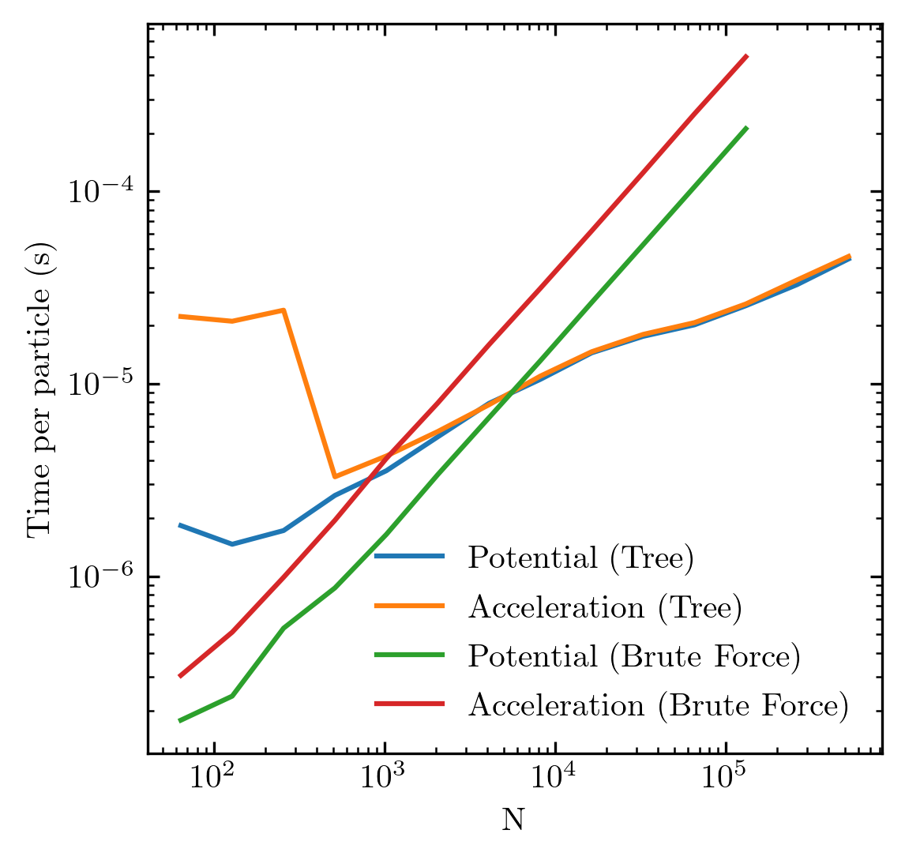

# Introduction

pytreegrav is a package that implements the Barnes-Hut method for computing the combined gravitational field and/or potential of N particles. We implement an oct-tree as a numba jitclass to achieve much higher peformance than the equivalent pure Python implementation, without writing a single line of C or Cython.

# Walkthrough

First let's import the stuff we want and generate some particle positions and masses

```python
import numpy as np
from pytreegrav import Accel, Potential, BruteForcePotential, BruteForceAccel
```


```python
x = np.random.rand(10**5,3) # positions randomly sampled in the unit cube
m = np.random.rand(10**5) # masses
```

Now let's compare the runtimes of the tree methods and brute force methods for computing the potential and acceleration. Note that all functions are jit-compiled by Numba, so the brute force in particular will run at C-like speeds.


```python
%time phi_tree = Potential(x,m)
%time a_tree = Accel(x,m)
%time phi_brute = BruteForcePotential(x,m)
%time a_brute = BruteForceAccel(x,m)
```

    CPU times: user 608 ms, sys: 8 ms, total: 616 ms
    Wall time: 614 ms
    CPU times: user 626 ms, sys: 4.01 ms, total: 630 ms
    Wall time: 629 ms
    CPU times: user 15.8 s, sys: 16 ms, total: 15.8 s
    Wall time: 15.8 s
    CPU times: user 37.6 s, sys: 8.05 ms, total: 37.6 s
    Wall time: 37.5 s


pytreegrav also supports OpenMP multithreading, but no support for higher parallelism is implemented. We can make it even faster by running in parallel:


```python
%time a_tree = Accel(x,m,parallel=True)
```

    CPU times: user 1.65 s, sys: 28 ms, total: 1.68 s
    Wall time: 166 ms


The treecode will almost always be faster than brute force for particle counts greater than ~10000. Below is a tougher benchmark for more realistic problem, run on a single core. The particles were arranged in a Plummer distribution and an opening angle of 0.7 was used instead of the default 1:



The method is approximate, using a Barnes-Hut opening angle of 1 by default; we can check the RMS force error here:


```python
delta_a = np.sum((a_brute-a_tree)**2,axis=1)
amag = np.sum(a_brute**2,axis=1)
print("RMS force error: %g"%np.sqrt(np.average(delta_a/amag)))
```

    RMS force error: 0.0345507


We can improve the accuracy by choosing a smaller theta:


```python
a_tree = Accel(x,m,parallel=True, theta=0.7)
delta_a = np.sum((a_brute-a_tree)**2,axis=1)
amag = np.sum(a_brute**2,axis=1)
print("RMS force error: %g"%np.sqrt(np.average(delta_a/amag)))
```

    RMS force error: 0.0123373

# What if I want to evaluate the fields at different points than where the particles are?

Easy peasy lemon squeezy. First build the tree, then feed the target points into GetPotential or GetAccel.

```python
from pytreegrav import ConstructKDTree, GetAccel, GetPotential, GetAccelParallel, GetPotentialParallel
```

```python
# generate the source mass distribution of particles: positions, masses, softenings
source_points = np.random.normal(size=(10**4,3))
source_masses = np.repeat(1./len(source_points), len(source_points))
source_softening = np.repeat(.1, len(source_points))

# construct the tree
tree = ConstructKDTree(source_points, source_masses, source_softening)

# target points where you wanna know the field values
target_points = np.random.normal(size=(10**3,3))

# Calculate the fields at the target points
target_accel = GetAccel(target_points, tree, G=1., theta=0.7)
target_potential = GetPotential(target_points, tree, G=1., theta=0.7)

# optionally, can also parallelize over the target points for extra awesomeness. Note that this currently requires softening as a non-optional argument due to a bug in numba
target_softening = np.zeros(len(target_points))
target_accel = GetAccelParallel(target_points, tree, target_softening, G=1., theta=0.7)
target_potential = GetPotentialParallel(target_points, tree, G=1., theta=0.7)
```

# Planned Features

* Greater parallelism, e.g. in the tree-build algorithm, support for massive parallelism
* Support for computing approximate correlation and structure functions.

Stay tuned! If there is any feature that would make pytreegrav useful for your project, just let me know!
