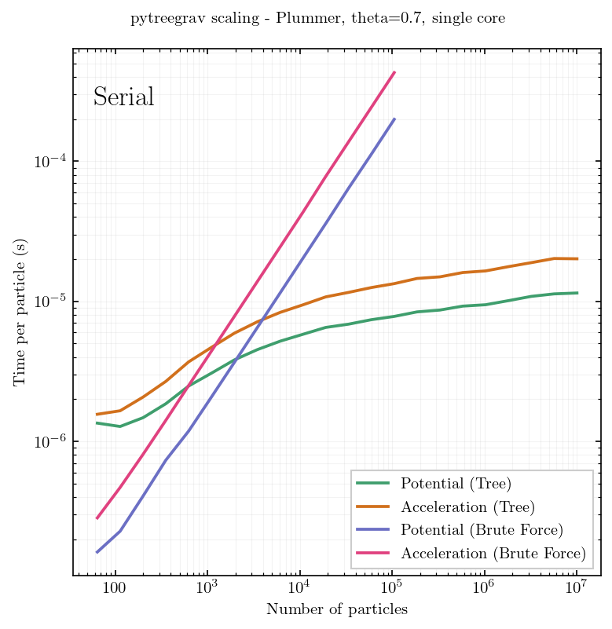
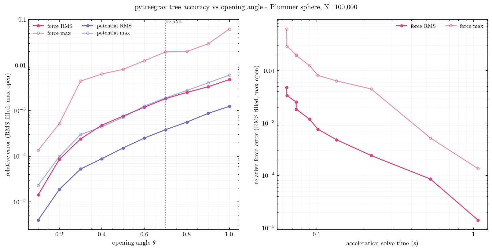

[](https://pypi.org/project/pytreegrav)[](https://pytreegrav.readthedocs.io/en/latest/?badge=latest)

# Introduction
pytreegrav is a package for computing the gravitational potential and/or field of a set of particles. It includes methods for brute-force direction summation and for the fast, approximate Barnes-Hut treecode method. For the Barnes-Hut method we implement an oct-tree as a numba jitclass to achieve much higher peformance than the equivalent pure Python implementation, without writing a single line of C or Cython. Full documentation is available [here](http://pytreegrav.readthedocs.io).

# Installation

```pip install pytreegrav``` or clone the repo and run ```python setup.py install``` from the repo directory.

# Walkthrough
First let's import the stuff we want and generate some particle positions and masses - these would be your particle data for whatever your problem is.


```python
import numpy as np
from pytreegrav import Accel, Potential
```


```python
N = 10**5 # number of particles
x = np.random.rand(N,3) # positions randomly sampled in the unit cube
m = np.repeat(1./N,N) # masses - let the system have unit mass
h = np.repeat(0.01,N) # softening radii - these are optional, assumed 0 if not provided to the frontend functions
```

Now we can use the ``Accel`` and ``Potential`` functions to compute the gravitational field and potential at each particle position:


```python
print(Accel(x,m,h))
print(Potential(x,m,h))
```

    [[-0.1521787   0.2958852  -0.30109005]
     [-0.50678204 -0.37489886 -1.0558666 ]
     [-0.24650087  0.95423467 -0.175074  ]
     ...
     [ 0.87868472 -1.28332176 -0.22718531]
     [-0.41962742  0.32372245 -1.31829084]
     [ 2.45127054  0.38292881  0.05820412]]
    [-2.35518057 -2.19299372 -2.28494218 ... -2.11783337 -2.1653377
     -1.80464695]


By default, pytreegrav will try to make the optimal choice between brute-force and tree methods for speed, but we can also force it to use one method or another. Let's try both and compare their runtimes (all timings quoted in this walkthrough are single-core, on an otherwise-idle Intel Xeon Gold 6244):


```python
from time import time
t = time()
# tree gravitational acceleration
accel_tree = Accel(x,m,h,method='tree')
print("Tree accel runtime: %gs"%(time() - t)); t = time()

accel_bruteforce = Accel(x,m,h,method='bruteforce')
print("Brute force accel runtime: %gs"%(time() - t)); t = time()

phi_tree = Potential(x,m,h,method='tree')
print("Tree potential runtime: %gs"%(time() - t)); t = time()

phi_bruteforce = Potential(x,m,h,method='bruteforce')
print("Brute force potential runtime: %gs"%(time() - t)); t = time()
```

    Tree accel runtime: 0.556318s
    Brute force accel runtime: 40.9757s
    Tree potential runtime: 0.326653s
    Brute force potential runtime: 18.9015s


As you can see, the tree-based methods can be much faster than the brute-force methods, especially for particle counts exceeding a few thousand. Here's an example of how much faster the treecode is when run on a Plummer sphere with a variable number of particles, on a single core of an Intel Xeon Gold 6244 workstation:



But there's no free lunch here: the tree methods are approximate. Let's quantify the RMS errors of the stuff we just computed, compared to the exact brute-force solutions:


```python
acc_error = np.sqrt(np.mean(np.sum((accel_tree-accel_bruteforce)**2,axis=1))) # RMS force error
print("RMS force error: ", acc_error)
phi_error = np.std(phi_tree - phi_bruteforce)
print("RMS potential error: ", phi_error)
```

    RMS force error:  0.00390130
    RMS potential error:  0.00025342


The above errors are typical for default settings: ~0.2% RMS force error and ~0.1% RMS potential error (relative to the RMS field strength). The error in the tree approximation is controlled by the Barnes-Hut opening angle ``theta``, set to 0.7 by default. Smaller ``theta`` gives higher accuracy, but also runs slower:


```python
thetas = 0.1,0.2,0.4,0.8 # different thetas to try
for theta in thetas:
    t = time()    
    accel_tree = Accel(x,m,h,method='tree',theta=theta)
    acc_error = np.sqrt(np.mean(np.sum((accel_tree-accel_bruteforce)**2,axis=1)))
    print("theta=%g Runtime: %gs RMS force error: %g"%(theta, time()-t, acc_error))
```

    theta=0.1 Runtime: 19.4092s RMS force error: 2.62033e-05
    theta=0.2 Runtime: 5.70894s RMS force error: 0.000161552
    theta=0.4 Runtime: 1.46086s RMS force error: 0.00087864
    theta=0.8 Runtime: 0.430208s RMS force error: 0.00618697


## Accuracy versus cost

The tree walk's cost scales roughly as ``theta^-3``, so it is worth knowing what that buys. The sweep
above is serial and quotes *absolute* error; the figure below is the same experiment run **in
parallel** with errors normalised, so the two sets of timings are not directly comparable. Running
[``examples/error_benchmark.py``](examples/error_benchmark.py) on a 10^5-particle Plummer sphere gives:



Errors are relative to the RMS field strength of the system (and to ``std(phi)`` for the potential,
whose zero point is arbitrary). Some representative points for the acceleration:

| ``theta`` | RMS error | max error | solve time |
| --- | --- | --- | --- |
| 0.1 | 1.4e-05 | 1.3e-04 | 1.07 s |
| 0.4 | 4.8e-04 | 6.4e-03 | 0.13 s |
| 0.7 (default) | 1.8e-03 | 1.9e-02 | 0.07 s |
| 1.0 | 4.8e-03 | 6.2e-02 | 0.06 s |

Two things worth noting. First, **the maximum error is consistently ~10x the RMS error** across the
whole range: the treecode error distribution has a long tail, so if your problem is sensitive to the
worst-case error on any single particle, budget an order of magnitude above the RMS figure. Second,
the returns are strongly diminishing in the direction of small ``theta`` -- going from ``theta=1.0``
to ``theta=0.1`` costs ~17x the runtime to buy ~340x the accuracy, but most of that accuracy gain is
already available by ``theta=0.4`` at a quarter of the cost. The right-hand panel plots error directly
against solve time, which is usually the more decision-relevant view.

The potential is roughly 4-5x more accurate than the acceleration at fixed ``theta``, because it
converges faster in the multipole expansion.

Both brute-force and tree-based calculations can be parallelized across all available logical cores via OpenMP, by specifying ``parallel=True``. This can speed things up considerably, with parallel scaling that will vary with your core and particle number:


```python
from time import time
t = time()
# tree gravitational acceleration
accel_tree = Accel(x,m,h,method='tree',parallel=True)
print("Tree accel runtime in parallel: %gs"%(time() - t)); t = time()

accel_bruteforce = Accel(x,m,h,method='bruteforce',parallel=True)
print("Brute force accel runtime in parallel: %gs"%(time() - t)); t = time()

phi_tree = Potential(x,m,h,method='tree',parallel=True)
print("Tree potential runtime in parallel: %gs"%(time() - t)); t = time()

phi_bruteforce = Potential(x,m,h,method='bruteforce',parallel=True)
print("Brute force potential runtime in parallel: %gs"%(time() - t)); t = time()
```

    Tree accel runtime in parallel: 0.222271s
    Brute force accel runtime in parallel: 7.25576s
    Tree potential runtime in parallel: 0.181393s
    Brute force potential runtime in parallel: 5.72611s

For parallel *brute force* there are two kernels, and pytreegrav picks between them for you. The
straightforward one gives each thread a single target particle, so it can only ever write that
particle's own result and must therefore evaluate all N² pairs — twice the work of the serial
upper-triangular loop. Above ``SYMMETRIC_NMIN`` particles (1000) it instead uses a symmetrized kernel
that evaluates each pair once and writes both sides, worth close to the expected 2× (e.g. 145 ms →
74 ms at N=32768 on 16 threads). The price is per-thread scratch — ``nthreads*N`` doubles for the
potential, 3× that for the acceleration, so 13/38 MB at N=10⁵ on 16 threads. Below the crossover the
simpler kernel wins anyway, because the symmetrized one runs two parallel regions to its one and a
``prange`` costs a full thread-team barrier however few iterations it has.

You can call ``Potential_bruteforce_symmetric`` / ``Accel_bruteforce_symmetric`` directly if you want
to bypass the dispatch, but there is rarely a reason to.

# What if I want to evaluate the fields at different points than where the particles are?

We got you covered. The ``Target`` methods do exactly this: you specify separate sets of points for the particle positions and the field evaluation, and everything otherwise works exactly the same (including optional parallelization and choice of solver):


```python
from pytreegrav import AccelTarget, PotentialTarget

# generate a separate set of "target" positions where we want to know the potential and field
N_target = 10**4
x_target = np.random.rand(N_target,3)
h_target = np.repeat(0.01,N_target) # optional "target" softening: this sets a floor on the softening length of all forces/potentials computed

accel_tree = AccelTarget(x_target, x,m, softening_target=h_target, softening_source=h,method='tree') # we provide the points/masses/softenings we generated before as the "source" particles
accel_bruteforce = AccelTarget(x_target,x,m,softening_source=h,method='bruteforce')

acc_error = np.sqrt(np.mean(np.sum((accel_tree-accel_bruteforce)**2,axis=1))) # RMS force error
print("RMS force error: ", acc_error)

phi_tree = PotentialTarget(x_target, x,m, softening_target=h_target, softening_source=h,method='tree') # we provide the points/masses/softenings we generated before as the "source" particles
phi_bruteforce = PotentialTarget(x_target,x,m,softening_target=h_target, softening_source=h,method='bruteforce')

phi_error = np.std(phi_tree - phi_bruteforce)
print("RMS potential error: ", phi_error)
```

    RMS force error:  0.0029070938409950310
    RMS potential error:  0.00018373931733379673

# Ray-tracing

pytreegrav's octree implementation can be used for efficient tree-based searches for ray-tracing of unstructured data. Currently implemented is the method ``ColumnDensity``, which calculates the integral of the density field to infinity along a grid of rays originating at each particle (defaulting to 6 rays). For example:

```python
columns = ColumnDensity(x, m, h, parallel=True) # shape (N,6) array of column densities in 6 angular bins - this is fastest but least accurate
columns_10 = ColumnDensity(x, m, h, rays=10, parallel=True) # shape (N, 10) array column densities along 10 random rays
columns_random = ColumnDensity(x, m, h, randomize_rays=True, parallel=True) # can randomize the ray grid for each particle so that there are no correlated errors due to the angular discretization
columns_custom = ColumnDensity(x, m, h, rays=np.random.normal(size=(100,3)), parallel=True)  # can also pass an arbitrary set of rays for the raygrid; these need not be normalized
κ = 0.02 # example opacity, in code units
σ = m * κ # total cross-section in each particle is product of mass and opacity
𝛕 = ColumnDensity(x, σ, h, parallel=True) # can pass cross-section instead of mass to get optical depth
𝛕_eff = -np.log(np.exp(-𝛕.clip(-300,300)).mean(axis=1)) # effective optical depth that would give the same radiation flux from a background; note clipping because overflow is not uncommon here
Σ_eff = 𝛕_eff / κ # effective column density *for this opacity* in code mass/code length^2
NH_eff = Σ_eff X_H / m_p  # column density in H nuclei code length^-2
```

## GPU-accelerated ray-tracing (optional)

The ray-traced path has an optional CUDA backend. On an RTX A6000 against 32 Xeon Gold 6244 threads it
is **12.3x** faster on a real astrophysical snapshot (22.3M gas particles, 6 rays, 134M walks: 52 s against
638 s). Clustered data is the harder case: a warp can hold both dense-core and diffuse-gas sightlines, so
lanes wait on each other, and the tree no longer fits in cache — smooth synthetic clouds do better, so
take this as the figure to expect on production data.

It is single precision, and on real data the error grows with the number of contributions summed
along a sightline, so it is a distribution rather than one number. Measured over 1.2M sightlines of
that snapshot, against the same walk in float64:

| median | p99 | p99.9 | p99.99 | max |
| --- | --- | --- | --- | --- |
| 1.5e-6 | 3.7e-5 | 9.7e-5 | 2.2e-4 | 2.3e-2 |

The worst cases are the *densest* sightlines — 0.0003% of entries exceed 1e-3, and their median column
is ~2000x the overall median. Those are the ones where τ ≫ 1 and the answer is "opaque" regardless, so
this is comfortably below the error of the uniform-sphere density model itself. But the CPU path
agrees with direct summation to ~1e-15, so the two are not interchangeable if you need reproducible
digits.

```
pip install pytreegrav[cuda]     # adds numba-cuda; nothing changes for CPU-only users
```

```python
columns = ColumnDensity(x, m, h, rays=6, device="cuda")  # single shot; repacks and uploads each call
```

The tree upload is the fixed cost (~180 ms for a 1e6-particle tree, against ~500 ms for a 6-ray
pass), so for repeated evaluation — many ray grids, target subsets, or timesteps — hold a context
and reuse it:

```python
from pytreegrav.cuda import CudaColumnDensity
ctx = CudaColumnDensity(tree)                 # pack + upload once
columns = ctx(pos, rays)                      # per-call transfers are ~2% of runtime
```

Monopole gravity has the same flag:

```python
phi = Potential(x, m, h, theta=0.7, device="cuda")   # or Accel(...)
```

Gravity walks are short — under 0.1 µs/particle on the device — so the one-off tree upload dominates a
single call. On that snapshot, reusing a `CudaPotential`/`CudaAccel` context gives **20.9x** and
**21.4x** (0.91 s and 0.99 s against 19 s and 21 s on 32 threads); the single-shot flag above, which
packs and uploads the tree every call (0.43 s at this N), gives **14.2x** and **14.9x**.

Measured float32 error against the *same, ungrouped* walk in float64 — the algorithm the device actually
runs: potential 1.3e-7 median / 7.5e-6 worst, acceleration 2.0e-9 / 1.9e-4. Diffing against the *default*
CPU path instead gives 1.8e-5 / 2.7e-3 and 4.9e-6 / 5.4e-3, two orders of magnitude larger — but that is
the CPU's target grouping opening a superset of nodes, not precision: both sets of numbers are unchanged
if the device kernels are compiled in float64.

Brute force takes the flag too, and it is where the GPU is at its best — no traversal, no divergence,
pure arithmetic:

```python
phi = Potential(x, m, h, method="bruteforce", device="cuda")
```

**387 Gpair/s** on an A6000 against roughly 10 on 32 CPU threads, about **40x**. Because brute force is
exact, the useful consequence is where the crossover moves: on the GPU it stays cheaper than the *tree*
out to N ≈ 1e5, against N ≈ 7e3 on 32 CPU threads — a much wider range in which you can skip the
approximation entirely. Its error is float32 accumulation and nothing else (no `theta`, so no tail),
growing as √N: 2.4e-6 at N = 1e3, 5.1e-5 at N = 6e4.

Below N ≈ 5e3 the GPU is *slower* than 32 CPU threads for either method — a launch plus an upload is not
worth amortizing over that little work. See `examples/benchmark_scaling.py --cuda` and
[examples/benchmark_scaling_cuda.png](examples/benchmark_scaling_cuda.png).

`pytreegrav.cuda` is never imported by the package itself, so a CPU-only install is unaffected. For
column density it applies to the ray-traced path only (`rays` given, `randomize_rays` off), not the
6-bin estimator; for gravity, to the monopole tree and to brute force.

# Community

This code is actively developed and maintained by Mike Grudic.

If you would like help using pytreegrav, please ask a question on our [Discussions](https://github.com/mikegrudic/pytreegrav/discussions) page.

If you have found a bug or an issue using pytreegrav, please open an [issue](https://github.com/mikegrudic/pytreegrav/issues).
