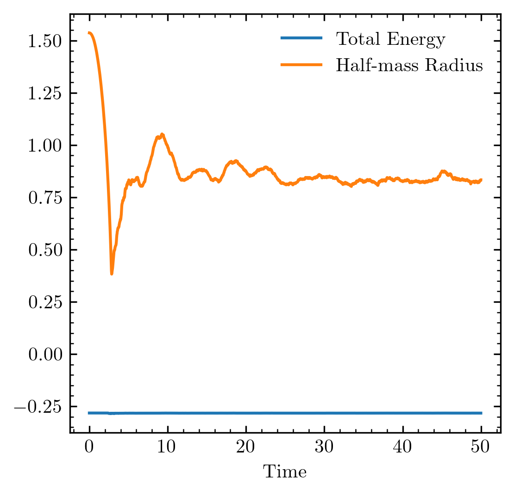

Example: N-body simulation
==========================

Here we provide a simple example of an N-body integrator implemented
using force and potential evaluation routines from pytreegrav. If you
were writing a more serious simulation code you would want to adopt a
more modular, object-oriented approach, but this suffices to demonstrate
the use of pytreegrav.

Initial Conditions
------------------

We first make a function to initialize some particles in a Gaussian
blob. You can try modifying the IC generator and playing around with the
initial velocity and geometry for extra fun. We also write a function to
evaluate the total energy, which is conserved down to tree-force and
integration errors.

.. code:: ipython3

    %pylab
    from pytreegrav import Accel, Potential
    
    def GenerateICs(N,seed=42):
        np.random.seed(seed) # seed the RNG for reproducibility
        pos = np.random.normal(size=(N,3)) # positions of particles
        pos -= np.average(pos,axis=0) # put center of mass at the origin
        vel = np.zeros_like(pos) # initialize at rest
        vel -= np.average(vel,axis=0) # make average velocity 0
        softening = np.repeat(0.1,N) # initialize softening to 0.1 
        masses = np.repeat(1./N,N) # make the system have unit mass
        return pos, masses, vel, softening
    
    def TotalEnergy(pos, masses, vel, softening):
        kinetic = 0.5 * np.sum(masses[:,None] * vel**2)
        potential = 0.5 * np.sum(masses * Potential(pos,masses,softening,parallel=True))
        return kinetic + potential

.. parsed-literal::

    Using matplotlib backend: MacOSX
    Populating the interactive namespace from numpy and matplotlib

Stepper function
----------------

Now let’s define the basic timestep for a leapfrog integrator, put in
the Hamiltonian split kick-drift-kick form (e.g. Springel 2005).

.. code:: ipython3

    def leapfrog_kdk_timestep(dt, pos, masses, softening, vel, accel):
        # first a half-step kick
        vel[:] = vel + 0.5 * dt * accel # note that you must slice arrays to modify them in place in the function!
        # then full-step drift
        pos[:] = pos + dt * vel
        # then recompute accelerations
        accel[:] = Accel(pos,masses,softening,parallel=True)
        # then another half-step kick
        vel[:] = vel + 0.5 * dt * accel  

Main simulation loop
--------------------

.. code:: ipython3

    pos, masses, vel, softening = GenerateICs(10000) # initialize initial condition with 10k particles
    
    accel = Accel(pos,masses,softening,parallel=True) # initialize acceleration
    
    t = 0 # initial time
    Tmax = 50 # final/max time
    
    energies = [] #energies
    r50s = [] #half-mass radii
    ts = [] # times
    
    
    while t <= Tmax: # actual simulation loop - this may take a couple minutes to run    
        r50s.append(np.median(np.sum((pos - np.median(pos,axis=0))**2,axis=1)**0.5))
        energies.append(TotalEnergy(pos,masses,vel,softening))
        ts.append(t)
        
        dt = 0.03 # adjust this to control integration error
    
        leapfrog_kdk_timestep(dt, pos, masses, softening, vel, accel)
        t += dt
        
    print("Simulation complete! Relative energy error: %g"%(np.abs((energies[0]-energies[-1])/energies[0])))

.. parsed-literal::

    Simulation complete! Relative energy error: 0.00161328

Analysis
--------

Now we can plot the half-mass radius (to get an idea of how the system
pulsates over time) and the total energy (to check for accuracy) as a
function of time

.. code:: ipython3

    %matplotlib inline
    plt.figure(figsize=(4,4),dpi=300)
    plt.plot(ts,energies,label="Total Energy")
    plt.plot(ts,r50s,label="Half-mass Radius")
    plt.xlabel("Time")
    plt.legend()

.. parsed-literal::

    <matplotlib.legend.Legend at 0x7fa6d7753820>

