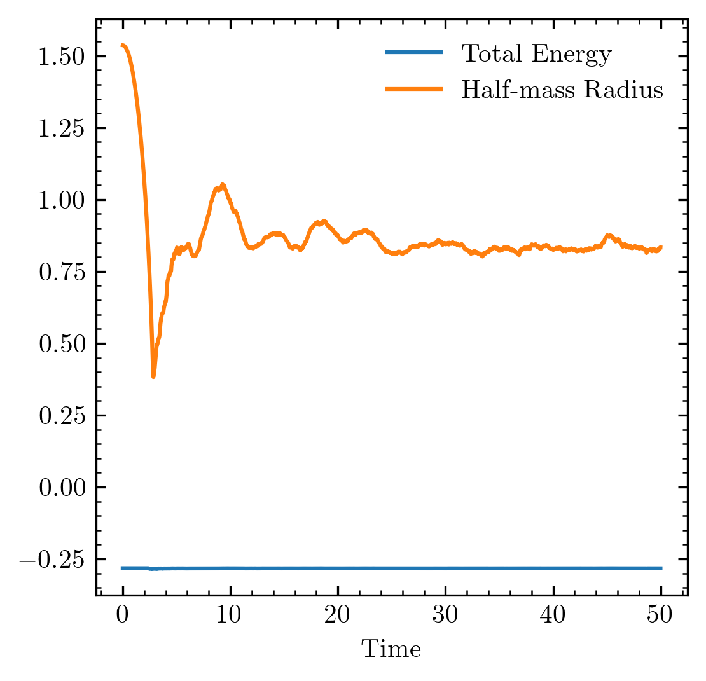
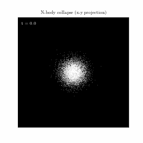

Example: N-body simulation
==========================

Here we provide a simple example of an N-body integrator implemented
using force and potential evaluation routines from pytreegrav. If you
were writing a more serious simulation code you would want to adopt a
more modular, object-oriented approach, but this suffices to demonstrate
the use of pytreegrav.

Initial Conditions
------------------

We first make a function to initialize some particles in a Gaussian
blob. You can try modifying the IC generator and playing around with the
initial velocity and geometry for extra fun. We also write a function to
evaluate the total energy, which is conserved down to tree-force and
integration errors.

``compute_accel`` is the one place the force solver is configured. Both
the initial conditions below and every timestep call it, so switching to
``quadrupole=True``, a different ``theta``, or ``device="cuda"`` is a
one-line change rather than a hunt through the notebook.

.. code:: ipython3

    %pylab
    from pytreegrav import Accel, Potential

    def compute_accel(pos, masses, softening):
        """Acceleration on every particle -- the only place the force solver is configured."""
        return Accel(pos, masses, softening, parallel=True)

    def GenerateICs(N, seed=42):
        np.random.seed(seed)  # seed the RNG for reproducibility
        pos = np.random.normal(size=(N, 3))  # positions of particles
        pos -= np.average(pos, axis=0)  # put center of mass at the origin
        vel = np.zeros_like(pos)  # initialize at rest
        vel -= np.average(vel, axis=0)  # make average velocity 0
        softening = np.repeat(0.1, N)  # initialize softening to 0.1
        masses = np.repeat(1.0 / N, N)  # make the system have unit mass
        return pos, masses, vel, softening

    def TotalEnergy(pos, masses, vel, softening):
        kinetic = 0.5 * np.sum(masses[:, None] * vel**2)
        potential = 0.5 * np.sum(masses * Potential(pos, masses, softening, parallel=True))
        return kinetic + potential

.. parsed-literal::

    Using matplotlib backend: MacOSX
    Populating the interactive namespace from numpy and matplotlib

Stepper function
----------------

Now let’s define the basic timestep for a leapfrog integrator, put in
the Hamiltonian split kick-drift-kick form (e.g. Springel 2005).

.. code:: ipython3

    def leapfrog_kdk_timestep(dt, pos, masses, softening, vel, accel):
        # first a half-step kick
        vel[:] = vel + 0.5 * dt * accel  # note that you must slice arrays to modify them in place in the function!
        # then full-step drift
        pos[:] = pos + dt * vel
        # then recompute accelerations
        accel[:] = compute_accel(pos, masses, softening)
        # then another half-step kick
        vel[:] = vel + 0.5 * dt * accel

Main simulation loop
--------------------

.. code:: ipython3

    import time

    pos, masses, vel, softening = GenerateICs(10000)  # initialize initial condition with 10k particles

    accel = compute_accel(pos, masses, softening)  # initialize acceleration

    t = 0  # initial time
    Tmax = 50  # final/max time
    dt = 0.03  # adjust this to control integration error

    energies = []  # energies
    r50s = []  # half-mass radii
    ts = []  # times

    # snapshots for the movie below - store positions every Nth step, aimed at ~120 frames
    n_steps = int(Tmax / dt)
    # note: %pylab shadows the builtin min() and max() with numpy's, so the clamps below are spelled out
    snapshot_interval = n_steps // 120 if n_steps > 120 else 1
    snapshots = []  # particle positions at each recorded step
    snap_times = []  # the times those snapshots were taken at
    step = 0
    t_start = time.time()

    while t <= Tmax:  # actual simulation loop - this may take a couple minutes to run
        r50s.append(np.median(np.sum((pos - np.median(pos, axis=0)) ** 2, axis=1) ** 0.5))
        energies.append(TotalEnergy(pos, masses, vel, softening))
        ts.append(t)

        if step % snapshot_interval == 0:  # save a frame for the movie
            snapshots.append(pos.copy())  # copy - pos is modified in place by the stepper
            snap_times.append(t)

        leapfrog_kdk_timestep(dt, pos, masses, softening, vel, accel)
        t += dt
        step += 1

        # one-line progress bar, rewritten in place with a carriage return
        frac = step / n_steps
        if frac > 1.0:  # the loop runs on t, so the last step can overshoot n_steps slightly
            frac = 1.0
        elapsed = time.time() - t_start
        eta = elapsed * (1.0 - frac) / frac if frac > 0 else 0.0
        print(
            "\r[%-30s] %5.1f%%  step %d/%d  t = %5.2f  %.0fs elapsed, ~%.0fs left"
            % ("=" * int(30 * frac), 100 * frac, step, n_steps, t, elapsed, eta),
            end="",
            flush=True,
        )

    print()  # step off the progress bar line before the summary
    print("Simulation complete! Relative energy error: %g" % (np.abs((energies[0] - energies[-1]) / energies[0])))
    print("Recorded %d snapshots for the movie" % len(snapshots))

.. parsed-literal::

    [==============================] 100.0%  step 1667/1666  t = 50.01  24s elapsed, ~0s left
    Simulation complete! Relative energy error: 0.000332666
    Recorded 129 snapshots for the movie

Analysis
--------

Now we can plot the half-mass radius (to get an idea of how the system
pulsates over time) and the total energy (to check for accuracy) as a
function of time

.. code:: ipython3

    %matplotlib inline
    plt.figure(figsize=(4, 4), dpi=300)
    plt.plot(ts, energies, label="Total Energy")
    plt.plot(ts, r50s, label="Half-mass Radius")
    plt.xlabel("Time")
    plt.legend()

.. parsed-literal::

    <matplotlib.legend.Legend at 0x7fa6d7753820>

Movie
-----

The simulation loop above kept a copy of the particle positions every ``snapshot_interval`` steps, so we can watch the blob collapse and then pulsate.

``to_jshtml`` embeds the frames directly in the notebook as a self-contained JavaScript player, so it needs no external tools -- at the cost of making the ``.ipynb`` bigger. If you would rather have a video file, uncomment the ``anim.save`` line (that route needs ffmpeg).

.. code:: ipython3

    %matplotlib inline
    from matplotlib.animation import FuncAnimation
    from IPython.display import HTML

    # a handful of particles get flung far out; clip to the 99.5th percentile so the core stays visible
    lim = np.percentile(np.abs(np.concatenate(snapshots)), 99.5)

    fig, ax = plt.subplots(figsize=(4, 4), dpi=100)
    ax.set_facecolor("k")
    ax.set(xlim=(-lim, lim), ylim=(-lim, lim), xticks=[], yticks=[])
    ax.set_title("N-body collapse (x-y projection)", fontsize=9)

    points = ax.scatter(snapshots[0][:, 0], snapshots[0][:, 1], s=1, c="w", alpha=0.4, linewidths=0)
    clock = ax.text(0.03, 0.96, "", transform=ax.transAxes, color="w", fontsize=9, va="top")

    def update(frame):
        points.set_offsets(snapshots[frame][:, :2])
        clock.set_text("t = %.1f" % snap_times[frame])
        return points, clock

    anim = FuncAnimation(fig, update, frames=len(snapshots), interval=50, blit=True)
    plt.close(fig)  # suppress the static first frame rendering next to the player
    # anim.save("nbody.mp4", fps=20, dpi=150)  # uncomment for an MP4 instead (needs ffmpeg)
    HTML(anim.to_jshtml(fps=20))

(The notebook renders this as an interactive player; shown here as a pre-rendered
animation.)

